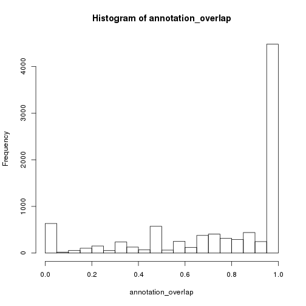
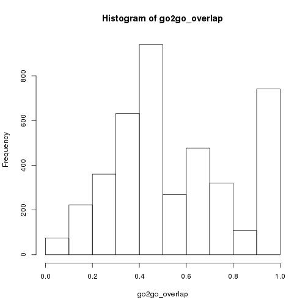
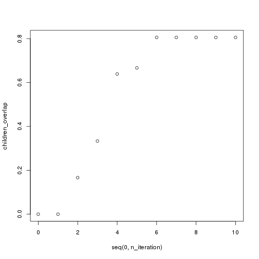

# GO ONMF

## Introduction

Kim and Yu, A Mutation Profile for Top-k Patient Search Exploiting Gene-Ontology
and Orthogonal Non-negative Matrix Factorization, Bioinformatics, 2015,
http://dx.doi.org/10.1093/bioinformatics/btv409

Kim and Yu recently published the above paper in which they develop a method
for creating a mutation-gene-ontology profile. As part of the overall procedure, 
they described (Section 2.3, *Gene Function Profile*):

> To reduce the term correlation, we use only the most specific terms, i.e. the leaf 
> node term after propagating the scores of the non-leaf terms down to the leaf node 
> terms. This approach also resolves the problem of evaluating genes annotated with 
> general term as the effect of the gene of function identification is spread out over 
> several leaf node terms.

This sounds troubling to my ears, because the Gene Ontology (GO) is a *directed 
acyclic graph* (DAG), wherein there are specific relationships between the terms, and
there is a directionality. There is also an expectation that when a gene product
is annotated to a *specific* term, then that gene product is also automatically
annotated to all of the *less-specific* **parent** terms in the DAG. 

What the procedure quoted above sounds like it is doing is essentially **adding**
more specific GO annotations to a gene product, which as far as I know is not allowed.

This document is a record of my investigation as to whether *more specific* GO
annotations are being added to gene products during the creation of the mutation 
profiles.

## Software

Kim and Yu made an `Octave` version of their software available at https://sites.google.com/site/postechdm/research/implementation/orgos, and a
tarball of the Octave version can be downloaded from https://sites.google.com/site/postechdm/research/implementation/orgos/ONMF_octave-simple.zip

```
wget https://sites.google.com/site/postechdm/research/implementation/orgos/ONMF_octave-simple.zip
mkdir ONMF_source
unzip ONMF_octave-simple.zip -d ONMF_source
```

As part of the software package, a few data files are provided. The ones that
are important for our purposes include: 

* ONMF_source/brca/go_(merged).csv - the index to GO term file
* ONMF_source/brca/gene_(merged).csv - the index to gene file
* exp_onmf_brca_mod.m - the file that runs the *brca* analysis
* network_gene2go(merged).csv - the gene 2 GO annotations

## Running Code

After modifying *exp_onmf_brca_mod.m* with:

> library_path = '/home/rmflight/Projects/personal/onmf/ONMF_source/ONMF_octave';

And in `Octave` I ran:

```
cd brca
run exp_onmf_brca.m
```

As this runs, it generates *gene2go.mat*, which is the propogated scores of gene
to GO associations.

I will use `Octave` to generate some indices and print them to files that can be
double checked in `R` (see [file](ONMF_source/brca/exp_onmf_brca_mod.m))


```
%% Orthogonal non-negative matrix factorization/Gene-Ontology-based stratification
library_path = '/home/rmflight/Projects/personal/onmf/ONMF_source/ONMF_octave';
addpath(genpath(library_path))
%% Convert somatic mutation cancer data to my data
patient2gene = load('network_patient2gene(merged).csv');
gene2go = load('network_gene2go(merged).csv');
go2go = load('network_allgo2allgo(merged).csv');
patient2gene = getSparse(patient2gene);
gene2go = getSparse(gene2go);
go2go = getSparse(go2go);
patient2gene(find(patient2gene)) = 1;
gene2go(find(gene2go)) = 1;
org_notzero = find(gene2go(1, :));
save -ascii org_notzero org_notzero;
[baseSMData, patient2gene, gene2go_new, go2go_new] = TuneData(patient2gene, gene2go, go2go);
isequal(go2go_new, go2go)
prop_notzero = find(gene2go_new(1, :));
save -ascii prop_notzero prop_notzero;
```

## Prerequisites

To continue this analysis, you will need some other `R` packages installed.


```r
install.packages(c("readr", "dplyr"))
library(BiocInstaller)
biocLite(c("GO.db", "graph", "org.Hs.eg.db"))
```


```r
library(readr)
library(dplyr)
library(GO.db)
library(org.Hs.eg.db)
```

## Check Actual Input Data

Lets check that the actual data being used as input looks right. **Note** that 
1 gets added to the map indices so that we easily work with the data from the
matrices in `Octave`.


```r
go_map <- read_csv("ONMF_source/brca/go_(merged).csv", 
                   col_names = c("loc", "GO"))
go_map$loc <- go_map$loc + 1
gene_map <- read_csv("ONMF_source/brca/gene_(merged).csv", 
                     col_names = c("loc", "GENE"))
gene_map$loc <- gene_map$loc + 1
gene2go <- read_csv("ONMF_source/brca/network_gene2go(merged).csv",
                    col_names = c("gene", "score", "GO"))
gene2go$gene <- gene2go$gene + 1
gene2go$GO <- gene2go$GO + 1
go2go <- read_csv("ONMF_source/brca/network_allgo2allgo(merged).csv",
                  col_names = c("GO1", "distance", "GO2"))
go2go$GO1 <- go2go$GO1 + 1
go2go$GO2 <- go2go$GO2 + 1
```

And translate to something we can actually use.


```r
gene2go$geneid <- unlist(gene_map[match(gene2go$gene, gene_map$loc), "GENE"],
                         use.names = FALSE)
gene2go$goid <- unlist(go_map[match(gene2go$GO, go_map$loc), "GO"],
                       use.names = FALSE)
```

And then query `org.Hs.eg.db` for the annotations as well.


```r
hs_gene2go <- select(org.Hs.eg.db, keys = unique(gene2go$geneid),
                     columns = c("GO", "ONTOLOGY"), keytype = "SYMBOL")
```

```
## 'select()' returned 1:many mapping between keys and columns
```

```r
hs_gene2go <- dplyr::filter(hs_gene2go, ONTOLOGY == "BP", EVIDENCE != "IEA")
```

And compare the annotations for the genes between them.


```r
annotation_overlap <- vapply(unique(hs_gene2go$SYMBOL), function(in_loc){
  hs_data <- dplyr::filter(hs_gene2go, SYMBOL == in_loc) %>%
    dplyr::select(., GO) %>% unlist()
  onmf_data <- dplyr::filter(gene2go, geneid == in_loc) %>%
    dplyr::select(., goid) %>% unlist()
  sum(hs_data %in% onmf_data) / length(hs_data)
}, numeric(1))
```

And check the distribution of overlap:


```r
hist(annotation_overlap)
```

 

That is great, over 4000 of the genes have what appear to be very similar terms!

Lets also check the **GO2GO** data.


```r
go_notself <- dplyr::filter(go2go, distance != 1)
go_notself$ID1 <- unlist(go_map[match(go_notself$GO1, go_map$loc), "GO"], use.names = FALSE)
go_notself$ID2 <- unlist(go_map[match(go_notself$GO2, go_map$loc), "GO"], use.names = FALSE)

onmf_pc <- split(go_notself$ID2, go_notself$ID1)
go_pc <- mget(names(onmf_pc), GOBPCHILDREN, ifnotfound = NA)

go2go_overlap <- vapply(names(onmf_pc), function(in_loc){
  go_data <- go_pc[[in_loc]]
  onmf_data <- onmf_pc[[in_loc]]
  sum(go_data %in% onmf_data) / length(go_data)
}, numeric(1))
```

And plot it:


```r
hist(go2go_overlap)
```

 

## Work With Single Gene (A2M)

Now lets work with a single gene, and see what is going on. We'll keep it simple
and play with the first one in the list, *A2M*.


```r
onmf_a2m_start <- dplyr::filter(gene2go, geneid == "A2M") %>%
  dplyr::select(goid) %>% unlist(., use.names = FALSE) %>% sort()

onmf_a2m_indices_org <- scan(file = "ONMF_source/brca/org_notzero", what = numeric(),
                         sep = " ")
onmf_a2m_indices_org <- onmf_a2m_indices_org[!is.na(onmf_a2m_indices_org)]
onmf_a2m_matrix_org <- dplyr::filter(go_map, loc %in% onmf_a2m_indices_org) %>%
  dplyr::select(GO) %>% unlist(., use.names = FALSE) %>% sort()

onmf_a2m_indices_prop <- scan(file = "ONMF_source/brca/prop_notzero", 
                              what = numeric(), sep = " ")
onmf_a2m_indices_prop <- onmf_a2m_indices_prop[!is.na(onmf_a2m_indices_prop)]
onmf_a2m_matrix_prop <- dplyr::filter(go_map, loc %in% onmf_a2m_indices_prop) %>%
  dplyr::select(GO) %>% unlist(., use.names = FALSE) %>% sort()
```

Now, how many of the terms in the starting gene annotation actually in the database
annotation?


```r
hs_a2m_go <- dplyr::filter(hs_gene2go, SYMBOL == "A2M") %>%
  dplyr::select(GO) %>% unlist(., use.names = FALSE) %>% unique()
sum(onmf_a2m_matrix_org %in% hs_a2m_go) / length(onmf_a2m_matrix_org)
```

```
## [1] 0.8
```

OK, seems we have most of them. Good.

Next, are the propogated terms actually children of the starting terms? We will
use multiple iterations of calls to `GOBPCHILDREN` and see if we get progressively
more of the terms.


```r
n_iteration <- 10
query_list <- onmf_a2m_matrix_org
children_overlap <- numeric(n_iteration + 1)

for (i_iter in seq(1, n_iteration)) {
  children_overlap[i_iter + 1] <- 
    sum(onmf_a2m_matrix_prop %in% query_list) / length(onmf_a2m_indices_prop)
  
  query_child <- mget(query_list, GOBPCHILDREN, ifnotfound = NA) %>% 
    unlist(., use.names = FALSE) %>% unique()
  query_child <- query_child[!is.na(query_child)]
  query_list <- unique(c(query_list, 
                       query_child))
}
```


```r
plot(seq(0, n_iteration), children_overlap)
```

 

**WE HAVE FOUND THEM**. The propogated terms have **NO** overlap with the original
terms, and are children of the original terms. Just to be sure, we will also
compare the propogated terms to the `GOALL` annotation, which would be all of
the GO terms that can **technically** be considered as **annotated** to the gene
in that all **terms** and their **parent** terms are **annotated** to a gene product.


```r
hs_a2m_all <- select(org.Hs.eg.db, keys = "A2M", columns = "GOALL", 
                     keytype = "SYMBOL")
```

```
## 'select()' returned 1:many mapping between keys and columns
```

```r
head(hs_a2m_all)
```

```
##   SYMBOL      GOALL EVIDENCEALL ONTOLOGYALL
## 1    A2M GO:0001775         TAS          BP
## 2    A2M GO:0001867         IDA          BP
## 3    A2M GO:0001868         IDA          BP
## 4    A2M GO:0001869         IDA          BP
## 5    A2M GO:0002020         IPI          MF
## 6    A2M GO:0002252         IDA          BP
```

```r
sum(hs_a2m_all$GOALL %in% onmf_a2m_matrix_org) # the starting annotation
```

```
## [1] 12
```

```r
sum(hs_a2m_all$GOALL %in% onmf_a2m_matrix_prop) # propogated annotation
```

```
## [1] 0
```

From this, none of the **propogated** terms can be properly considered as 
annotations to **A2M**. Effectively, the code has generated a new set of
GO annotations to **A2M**. I am sure this is the situation for all of the
genes.

# Possible Solution

I wonder if a GOSlim would have fixed the problem of redundancy without introducing
these new annotation relationships?
